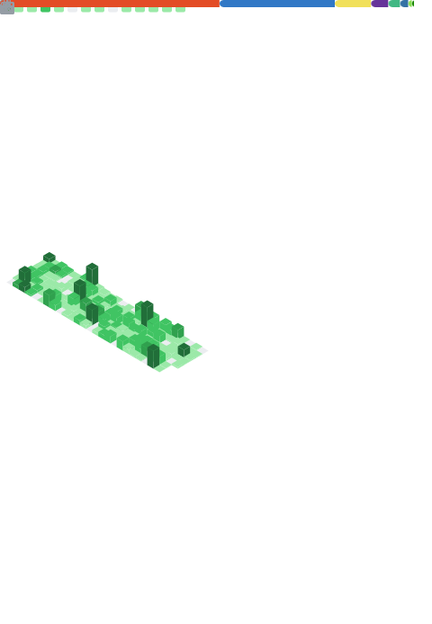

## I'm here 👋

I'm Akatsuki Yuito, a S High School Student in Mie-pref.,JP. 
I can many things. My motto is "Try anything!"

I too busy to response faster. Sorry.

<bold>Japanese / 日本語</bold>

  あかつきゆいとです！ 
  S高等学校の生徒で、三重県に住んでいます。 
  私のモットーは「なんでもやる(試してみる)」で、技術系のことは大抵なんでもできます。

  私は忙しく、あまり早く反応できません。すみません。

## I'm member of... / 所属

I belong to various organisations, but here I will focus on just a few of them.

<bold>Japanese / 日本語</bold>

  私はさまざまな団体に所属していますが、ここではその一部を取り上げます。

### All-Japan Digital Creative Club UniProject / デジタル創作サークルUniProject

 
UniProject is a club dedicated to all aspects of digital creativity, including programming, illustration, design and music production. 
I set this up with the aim of creating a place where digital creators can easily exchange information and socialise.

- HP - <https://uniproject.jp>
- Discord - <https://uniproject.jp/discord>
- Twitter - [@UniPro_digital](https://x.com/UniPro_digital)
- Qiita - [@unipro-tech](https://qiita.com/organizations/unipro-tech)
- GitHub - [@UniPro-tech](https://github.com/UniPro-tech)

<bold>Japanese / 日本語</bold>

  UniProjectはプログラミング、絵、デザイン、音楽制作を初めとしたデジタル創作活動全般を扱うサークルです。 
  デジタルクリエイターの情報交換など、 気軽に交流できる場所を目指して私が創設しました。

### Security Camp Committee / (一社) セキュリティ・キャンプ協議会

We are an organisation that runs ‘Security Camps’, led by instructors from both industry and academia, with the aim of identifying and nurturing young information security talent from Japan who will lead the next generation and succeed on the global stage.
I am a graduate of the programme and currently support the development of a community for alumni.

<bold>Japanese / 日本語</bold>

次代を担う日本発で世界に通用する若年層の情報セキュリティ人材を発掘・育成するため、産業界、教育界を結集した講師による「セキュリティ・キャンプ」を実施している団体です。
私はその修了生で今は修了生のコミュニティづくりを支援しています。

### SNS

[![Qiita](https://img.shields.io/badge/--FFFFFF?style=social&logo=&label=Follow%20yuito_it_)](https://qiita.com/yuito_it_)

### Chart

